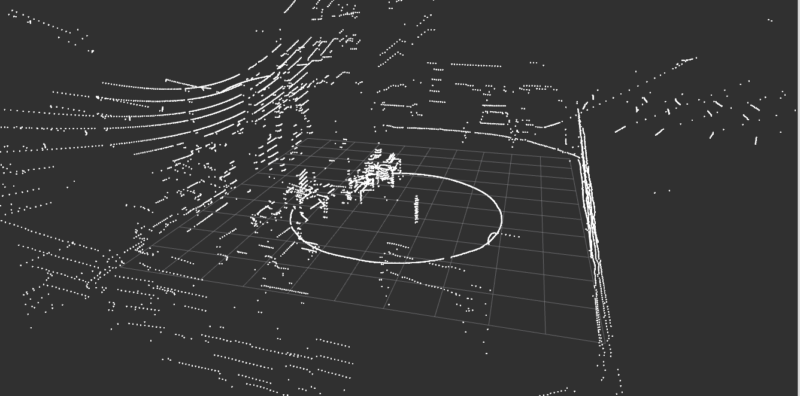
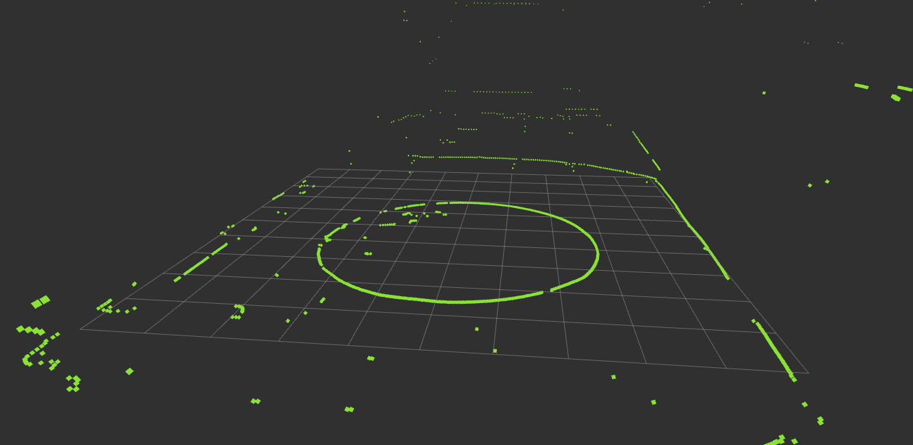
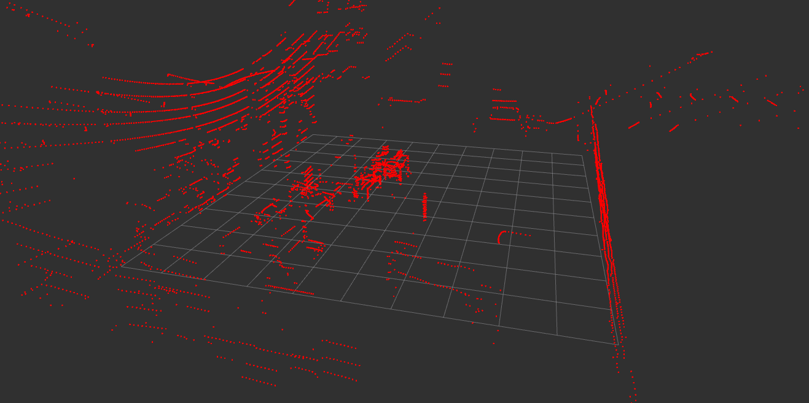

# PMF Ground Filter

The **PMF Ground Filter** is a ROS package designed for efficient ground segmentation using the Progressive Morphological Filter (PMF) algorithm. It processes point cloud data specifically from Sick Multiscan100 lidar sensors, allowing for effective differentiation between ground and non-ground points. This package is particularly beneficial for robotics and autonomous vehicle applications that require precise ground detection.

## Features

- Processes point cloud data from Sick Multiscan lidar sensors.
- Implements the Progressive Morphological Filter for robust ground segmentation.
- Utilizes a custom point type (`sick_pcl::PointXYZIR`) that includes intensity and ring information.
- Publishes separate PointCloud2 messages for ground and non-ground points.
- Optimized for seamless integration with LIO-SAM, demonstrating effective localization and mapping capabilities.

## Results
- **Input PointCloud:**

- **Ground PointCloud:**

- **NonGround PointCloud:**



## Installation

1. **Prerequisites**:
   - ROS (Robot Operating System) installed (Noetic is recommended).
   - PCL (Point Cloud Library) installed. Ensure you have the necessary dependencies for PCL.

2. **Clone the repository**:
   ```bash
   cd ~/catkin_ws/src
   git clone https://github.com/emirhancibir/pmf_ground_filter.git
   ```

3. **Build the package**:

    ```bash
    cd ~/catkin_ws
    catkin_make
    ```
4. **Source the workspace**:
    ```bash
    source devel/setup.bash
    ```

## Usage

1. **Launch the package**: Use a launch file to start the PMF Ground Filter. Modify parameters as necessary.

    ```bash
    roslaunch pmf_ground_filter pmf_ground_filter.launch
    ```
2. **Parameters**: The following parameters can be configured in the launch file or via command line:

    - **max_window_size:** Maximum window size for the PMF filter (default: 1).
    - **slope:** Slope threshold for ground segmentation (default: 1.0).
    - **initial_distance:** Initial distance for ground point identification (default: 0.3 meters).
    - **max_distance:** Maximum distance to consider for ground points (default: 2.0 meters).
    - **input_topic:** Topic to subscribe for input point cloud data (default: /cloud_all_fields_fullframe).
    - **non_ground_topic:** Topic to publish non-ground points (default: /non_ground_points).
    - **ground_topic:** Topic to publish ground points (default: /ground_points).


